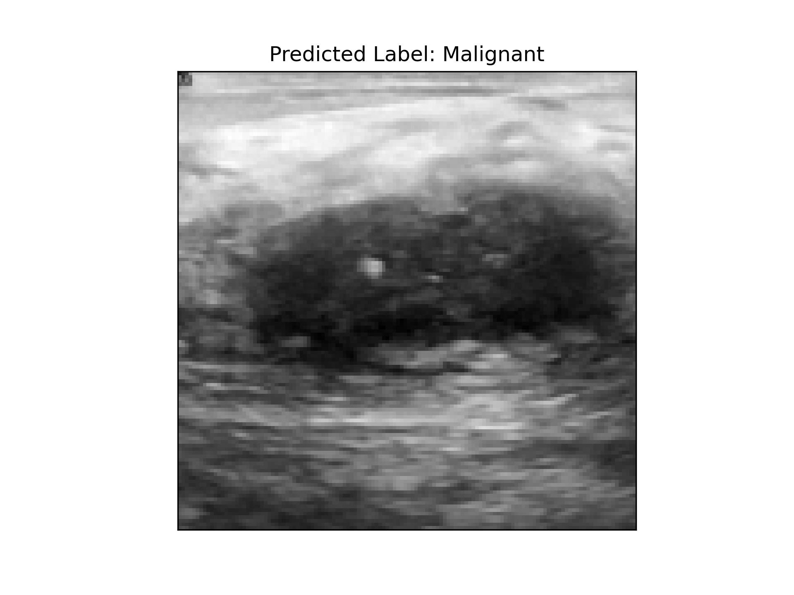

# Breast-Ultrasound-Image-Classification
Breast ultrasound image classification with Feed Forward Neural Network and PyTorch to classify the tumours in them. 

3 classes are considered; normal (no tumours found in the breast), bening and malignant. 

For this, we used the Breast Ultrasound Images Dataset, openly available dataset from Kaggle (https://www.kaggle.com/datasets/aryashah2k/breast-ultrasound-images-dataset?resource=download). The dataset contains more than 800 MRI scans with corresponding outline of the different tumours, which the model analyses and with throughout training and evaluation learns how to classify the tumour in the scans, using over 30 features, such as size, texture, smoothness. 

Feed-forward performs well only with pre-processed data, so in order to build up the model, data augmentation and normalization is needed. These were later fed into the training model, and the evaluation part validated the accuracy. As a final step, we implement a small testing phase, where the model classifies a random image from the dataset, which results in the following figure:  

